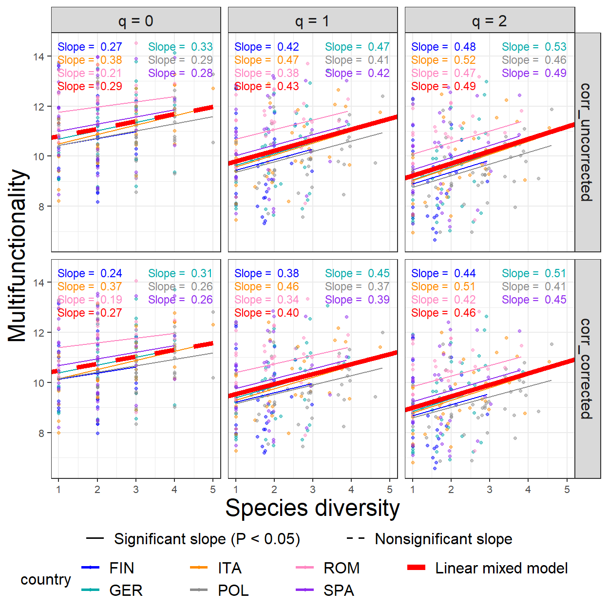
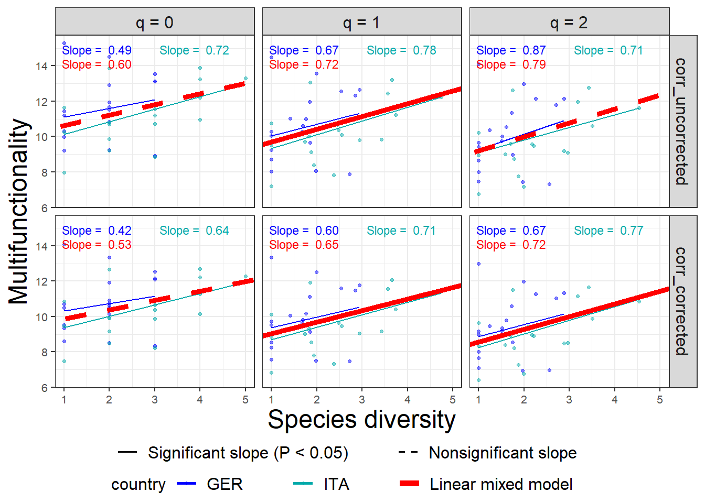
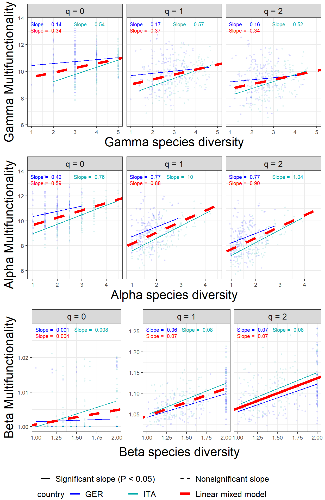

# MF.beta4 (R package)

<h5 align="right">
Latest version: 2023-11-27
</h5>
<font color="394CAE">
<h3 color="394CAE" style="font-weight: bold">
An Introduction to MF.beta4 via Examples
</h3>
</font> <br>
<h5>
<b>Anne Chao, Chun-Yu Liu, K. H. Hu</b> <br><br> <i>Institute of
Statistics, National Tsing Hua University, Hsin-Chu, Taiwan 30043</i>
</h5>

<br> <font color=#FF6600> </font>

`MF.beta4` is an R package for measuring ecosystem multifunctionality
and assessing BEF relationships. The measures are illustrated by using
ecosystem function and biodiversity data collected in a total of 209
plots in six European countries (the FunDivEUROPE dataset). All data are
available from the Dryad repository; see Ratcliffe et al. (2017b) and
Scherer-Lorenzen et al. (2023) for details. The software was originally
developed for the Beta4 project (Müller et al. 2022) on the effect of
enhancing the beta diversity between forest patches on ecosystem
multifunctionality and forest resilience across spatial scales.

Based on a framework of Hill-Chao numbers of orders q = 0, 1 and 2,
`MF.beta4` features the following multifunctionality measures for a
single and multiple ecosystems; see Chao et al. (2023) for pertinent
methodology and decomposition theory.

<u>1. Multifunctionality measures in a single ecosystem:</u>

`MF.beta4` computes a class of weighted multifunctionality measures for
given function weights. Multifunctionality measures that correct for
strong correlations between ecosystem functions to avoid redundancy are
also provided.

<u>2. Multifunctionality measures in multiple ecosystems:</u>

For given function weights, `MF.beta4` computes the gamma
multifunctionality of pooled ecosystems, the within-ecosystem component
(alpha multifunctionality) and the among-ecosystem component (beta
multifunctionality). The correlation between functions can also be
corrected for.

Based on biodiversity and function data from ecosystems, this package
also provides graphics for assessing biodiversity-ecosystem functioning
(BEF) relationships across scales.

## How to cite

If you publish your work based on the results from the MF.beta4 package,
you should make references to the following methodology paper and the R
package.

<li>
Chao, A., Chiu, C. H., Hu, K. H., van der Plas, F., Cadotte, M. W.,
Mitesser, O., et al. (2023). Hill-Chao numbers in multifunctionality
allows decomposing gamma multifunctionality into alpha and beta
components. To appear in <i>Ecology Letters</i>.
</li>
  
<li>
Chao, A., Liu, C. Y., and Hu, K. H. (2023). MF.beta4 package: measuring
ecosystem multifunctionality and assessing BEF relationships. Available
from CRAN.
</li>

## SOFTWARE NEEDED TO RUN MF.beta4 IN R

-   Required: [R](https://cran.r-project.org/)
-   Suggested: [RStudio
    IDE](https://www.rstudio.com/products/RStudio/#Desktop)

## HOW TO RUN MF.beta4:

The `MF.beta4` package can be downloaded from CRAN or Github
[MF.beta4_github](https://github.com/AnneChao/MF.beta4) using the
following commands. For a first-time installation, an additional
visualization extension package (`ggplot2`) must be installed and
loaded.

``` r
## install MF.beta4 package from CRAN
# install.packages("MF.beta4")  

## install the latest version from github
install.packages('devtools')
library(devtools)
install_github("AnneChao/MF.beta4")

## import packages
library(MF.beta4)
```

This package includes four functions, as listed below with default
arguments. See package manual for the detailed description of each
argument.

-   **function_normalization**: transforms ecosystem function data to
    values between 0 and 1; other variables remain unchanged.

``` r
function_normalization(data, fun_cols = 1:ncol(data), negative = NULL, by_group = NULL) 
```

-   **MF1_single**: computes multifunctionality measures of orders q =
    0, 1 and 2 for given function weights in a single ecosystem
    separately for two cases: (i) correlations between functions are not
    corrected for, and (ii) correlations between functions are corrected
    for.

``` r
MF1_single(func_data, species_data = NULL, weight = 1, q = c(0, 1, 2))
```

-   **MF2_multiple**: computes alpha, beta and gamma multifuctionality
    measures of orders q = 0, 1 and 2 for given function weights in
    multiple ecosystems separately for two cases (i) correlations
    between functions are not corrected for, and (ii) correlations
    between functions are corrected for.

``` r
MF2_multiple(func_data, species_data = NULL, weight = 1, q = c(0, 1, 2), by_group = NULL) 
```

-   **MFggplot**: provides the graphical BEF relationships based on the
    output obtained from the function `MF1_single` or `MF2_multiple`.

``` r
MFggplot(output, model = "LMM.both", by_group = NULL, caption = "slope")
```

## Data input format

#### Ecosystem function data

The FunDivEurope data are used here to demonstrate the use of the four
functions; see Ratcliffe et al. (2017a, b) and Scherer-Lorenzen et
al. (2023) for the original datasets. There are three datasets provided
with the package: raw ecosystem function dataset
(`forest_function_data_raw`), normalized function dataset
(`forest_function_data_normalized`), and biodiversity dataset
(`forest_biodiversity_data`). The first dataset includes the raw values
of 26 ecosystem functions collected from 209 plots in six European
countries, representing six major European forest types: boreal forest
(Finland, 28 plots); hemi-boreal (Poland, 43 plots); temperate deciduous
(Germany, 38 plots); mountainous deciduous (Romania, 28 plots);
thermophilous deciduous (Italy, 36 plots); and Mediterranean mixed
(Spain, 36 plots). Each plot is designated as an ecosystem in assessing
BEF relationships. See Table 1 of Ratcliffe et al. (2017a) for a
description of the 26 functions, and Ratcliffe et al. (2017a) and
Scherer-Lorenzen et al. (2023) for data details of the original
datasets.

In addition to row name (plot/ecosystem id) and column name (plot
information and function names), the data in the file
`forest_function_data_raw` are input as a data.frame with 209 plots
(rows) and 32 columns. The first 5 columns show the relevant plot
information, followed by 26 raw ecosystem functions (in consecutive
columns from 6 to 31). An additional column “country” for each plot is
added (as column 32) as a stratification/group variable because function
normalization and relevant decomposition analyses will be performed
within each country. For each missing value of functions in the original
dataset, the mean of the given function within the country was imputed.
Thus, the raw ecosystem function dataset provided with the package is
slightly different from the original one.

Run the following code for the data `forest_function_data_raw` to view
the first ten rows and five columns (columns 1:3, 6 and 7); columns 6
and 7 show respectively the first two raw ecosystem functions
(earthworm_biomass and fine_woody_debris) :

``` r
data("forest_function_data_raw")
forest_function_data_raw
```

    #>       plotid target_species_richness composition earthworm_biomass fine_woody_debris
    #> FIN01  FIN01                       2   Piab.Pisy             0.000               171
    #> FIN02  FIN02                       2     Be.Piab             0.465               110
    #> FIN03  FIN03                       2     Be.Piab             0.626                81
    #> FIN04  FIN04                       2     Be.Piab             0.000                82
    #> FIN05  FIN05                       2     Be.Pisy             0.928                38
    #> FIN06  FIN06                       1        Piab             0.000                75
    #> FIN07  FIN07                       1          Be            49.672                44
    #> FIN08  FIN08                       1          Be            28.013                38
    #> FIN09  FIN09                       1        Pisy             0.204                65
    #> FIN10  FIN10                       1        Piab             0.000               136

To meaningfully quantify multifunctionality in a ecosystem based on
multiple functions, all function values should be first normalized to
the range (0,1). Proper normalization can be performed by using
`function_normalization` provided in the package. In the FunDivEUROPE
data, the forests in the six countries represent different ecosystems,
all functions were thus normalized within a country, by specifying the
argument `by_group = "country"`. Because different transformations are
applied to positive and negative functionality, it is required to
specify negative functionality in the argument `"negative"`. In the raw
function dataset, there are 26 ecosystem functions (in consecutive
columns from 6 to 31). Among them, two are negative functionality:
`"soil_cn_ff_10"` and `"wue"`, and others are positive functionality.
Run the following code to view the first ten rows and five columns
(columns 1:3, 6 and 7); columns 6 and 7 show respectively the normalized
values of the first two ecosystem functions (earthworm_biomass and
fine_woody_debris):

``` r
data("forest_function_data_raw")
normalized_forest_function_data <- function_normalization(data = forest_function_data_raw,
                    fun_cols = 6:31, negative = c("soil_cn_ff_10","wue"), by_group = "country")
forest_function_data_raw
```

    #>       plotid target_species_richness composition earthworm_biomass fine_woody_debris
    #> FIN01  FIN01                       2   Piab.Pisy             0.000             0.416
    #> FIN02  FIN02                       2     Be.Piab             0.009             0.238
    #> FIN03  FIN03                       2     Be.Piab             0.013             0.152
    #> FIN04  FIN04                       2     Be.Piab             0.000             0.155
    #> FIN05  FIN05                       2     Be.Pisy             0.019             0.026
    #> FIN06  FIN06                       1        Piab             0.000             0.135
    #> FIN07  FIN07                       1          Be             1.000             0.044
    #> FIN08  FIN08                       1          Be             0.564             0.026
    #> FIN09  FIN09                       1        Pisy             0.004             0.106
    #> FIN10  FIN10                       1        Piab             0.000             0.314

This normalized dataset is exactly the same as the dataset
`forest_function_data_normalized` provide with the package.

#### Biodiversity data

The `forest_biodiversity_data` consist of three columns: the “plotID”
column includes the name of ecosystems/plots, the “species” column
includes species names, and the “abundance” column includes the
corresponding species abundance (basal area as a proxy of species
abundance),in addition to row and column names; see Scherer-Lorenzen et
al. (2023) for the original data. Because missing values of “basal area”
in the original dataset were imputed by the mean of the same species
within the country, and basal areas were combined for two species
(Betula pendula and Betula pubescens), the dataset provided with the
package is slightly different from the original dataset.

Run the following code to view the first ten rows of the biodiversity
data:

``` r
data("forest_biodiversity_data")
forest_biodiversity_data
```

    #> # A tibble: 10 × 3
    #> # Groups:   plotID [5]
    #>    plotID species          abundance
    #>    <chr>  <chr>                <dbl>
    #>  1 FIN01  Picea.abies          1.84 
    #>  2 FIN01  Pinus.sylvestris     0.535
    #>  3 FIN02  Betula.pendula       1.18 
    #>  4 FIN02  Picea.abies          0.408
    #>  5 FIN03  Betula.pendula       1.09 
    #>  6 FIN03  Picea.abies          0.215
    #>  7 FIN04  Betula.pendula       0.662
    #>  8 FIN04  Picea.abies          1.14 
    #>  9 FIN05  Betula.pendula       0.423
    #> 10 FIN05  Pinus.sylvestris     1.25

## Computing multifunctionality in a single ecosystem

Based on normalized function data, `MF1_single()` computes
multifunctionality measures of orders q = 0, 1 and 2 for given function
weights in a single ecosystem separately for two cases: (i) correlations
between functions are not corrected for, and (ii) correlations between
functions are corrected for.

When `species_data = NULL` (i.e., biodiversity data are not provided),
`MF1_single()` only computes multifunctionality measures of orders q =
0, 1 and 2 for each plot. When biodiversity data are specified
(`species_data = forest_biodiversity_data`), tree species diversity
values for q = 0, 1 and 2 are also computed.

Run the following code to view the first ten rows of the output:

``` r
data("forest_function_data_normalized")
data("forest_biodiversity_data")
output1 <- MF1_single(func_data = forest_function_data_normalized[,6:31],weight = 1,
           species_data = forest_biodiversity_data)
```

    #>    plotID             Type Order.q    qMF Species.diversity
    #> 1   FIN01 corr_uncorrected   q = 0 10.711             2.000
    #> 2   FIN01 corr_uncorrected   q = 1 10.026             1.704
    #> 3   FIN01 corr_uncorrected   q = 2  9.577             1.535
    #> 4   FIN01   corr_corrected   q = 0 10.351             2.000
    #> 5   FIN01   corr_corrected   q = 1  9.704             1.704
    #> 6   FIN01   corr_corrected   q = 2  9.275             1.535
    #> 7   FIN02 corr_uncorrected   q = 0  9.321             2.000
    #> 8   FIN02 corr_uncorrected   q = 1  8.359             1.768
    #> 9   FIN02 corr_uncorrected   q = 2  7.636             1.618
    #> 10  FIN02   corr_corrected   q = 0  9.022             2.000

The above output includes the ID of plot (`plotID`), `Type`
(corr_uncorrected and corr_corrected), the diversity order (`Order.q`),
the multifunctionality measure of order q (`qMF`) and tree species
diversity (`Species.diversity`).

## Computing alpha, beta and gamma multifunctionality for any pair of plots within a country

`MF2_multiple()` computes alpha, beta and gamma multifuctionality
measures of orders q = 0, 1 and 2 for given function weights in multiple
ecosystems separately for two cases: (i) correlations between functions
are not corrected for, and (ii) correlations between functions are
corrected for. The decomposition of mltifunctionality measure of order q
is based on all pairs of plots separately within each country. The alpha
scale refers to individual plots, whereas the gamma scale refers to the
two collective plots.

When `species_data = NULL` (i.e., biodiversity data are not provided),
`MF2_multiple` computes alpha, beta, and gamma multifunctionality values
for q = 0, 1 and 2 for all pairs of plots within each country. When
biodiversity data are specified
(`species_data = forest_biodiversity_data`), tree species diversity
values for q = 0, 1 and 2 are also computed.

Due to sparse data in Finland (with richness levels of only one or two
species in 90% of plots), data from Finland are excluded from following
computation. Run the following code to view the first ten rows of the
output:

``` r
data("forest_function_data_normalized")
data("forest_biodiversity_data")
forest_function_data_normalized <- forest_function_data_normalized %>% filter(country != "FIN")
forest_biodiversity_data <- forest_biodiversity_data[-(1:48),]
output2 = MF2_multiple(func_data = forest_function_data_normalized[,6:32],
                      species_data = forest_biodiversity_data,
                      weight = 1,
                      by_group = "country")
```

    #>             plotID country Order.q             Type Scale   qMF Species.diversity
    #> 1  GER01 vs. GER02     GER   q = 0 corr_uncorrected Gamma 9.257             1.000
    #> 2  GER01 vs. GER02     GER   q = 0 corr_uncorrected Alpha 9.257             1.000
    #> 3  GER01 vs. GER02     GER   q = 0 corr_uncorrected  Beta 1.000             1.000
    #> 4  GER01 vs. GER02     GER   q = 0   corr_corrected Gamma 8.985             1.000
    #> 5  GER01 vs. GER02     GER   q = 0   corr_corrected Alpha 8.985             1.000
    #> 6  GER01 vs. GER02     GER   q = 0   corr_corrected  Beta 1.000             1.000
    #> 7  GER01 vs. GER02     GER   q = 1 corr_uncorrected Gamma 7.949             1.000
    #> 8  GER01 vs. GER02     GER   q = 1 corr_uncorrected Alpha 7.840             0.999
    #> 9  GER01 vs. GER02     GER   q = 1 corr_uncorrected  Beta 1.014             1.001
    #> 10 GER01 vs. GER02     GER   q = 1   corr_corrected Gamma 7.773             1.000

The above output includes the combinations of two plots (`plotID`),
`Country` of the two plots, `Type` (corr_uncorrected or corr_corrected),
`Scale` (gamma, alpha or beta), the diversity order (`Order.q`),
multifunctionality value of order q (`qMF`) and the corresponding
gamma/alpha/beta species diversity (`Species.diversity`).

NOTE: Because the total number of pair plots is huge, it is very time
consuming to obtain the numerical output and graphical displays from
running the above code. Users can simply select part of the data to
quickly view/obtain the output. See later part for a simple example
based on only 18 plots from Germany and Italy.

## Assessing BEF Relationships by MFggplot()

Function `MFggplot()` provides the graphical BEF relationships based on
the output from the function `MF1_single` or `MF2_multiple`.

#### Within-plot BEF relationship

For an <code>MF1_single</code> object of given individual function
weights, function `MFggplot` plots the BEF relationship between
multifunctionality of order q (= 0, 1 and 2) and species diversity of
the same order q for two cases: (i) correlations between functions are
not corrected for. (ii) correlations between functions are corrected
for. The fitted lines for the chosen model are also shown in the figure.

Below we demonstrate how to reveal BEF relationships under the most
useful linear mixed-effects model (`model = "LMM.both"`). Under the
model, for each value of q, the relationship between tree species
diversity and multifunctionality is modeled using a linear mixed-effects
model with random slopes and random intercepts for each country. To fit
a linear mixed-effect model, the stratification/group variable must be
specified (e.g., `by_group = "country"` in the following code). If
`by_group = NULL`, one can only fit linear model (`model = "lm"`). Run
the following code to reveal the overall fixed-effect slopes (bold red
lines) and each country’s relationships (thin lines) estimated from the
same linear mixed model. All the fitted results and the associated test
of significance for the overall slopes and R-squared were based on the
output using the function “lmer” in the R packages “lme4” and
“lmerTest”.

``` r
data("forest_function_data_normalized")
output1 <- data.frame(output1, country=rep(forest_function_data_normalized$country, each = 6))
MFggplot(output1, model = "LMM.both", by_group = "country", caption = "slope")
```



#### BEF relationships at gamma, alpha and beta scales

For an <code>MF2_multiple</code> object of given individual function
weights, function `MFggplot` plots the BEF relationship between
alpha/beta/gamma multifunctionality of order q (= 0, 1 and 2) and the
corresponding alpha/beta/gamma species diversity of the same order q for
two cases: (i) correlations between functions are not corrected for.
(ii) correlations between functions are corrected. The fitted lines for
the chosen model are also shown in the figure.

By default, the BEF relationship for each scale is modeled using a
linear mixed model with random slopes and random intercepts for each
country. Run the following code to obtain the BEF graphical
relationships when correlations are not corrected for. (Data from
Finland are not considered in the plots, as explained earlier. See the
package manual for a simple example where the code for plotting BEF
relationships based on 18 plots from Germany and Italy is available.)

``` r
figure_LMM <- MFggplot(output2, model = "LMM.both", by_group = "country", caption = "slope")
```

``` r
figure_LMM$corr_uncorrected$ALL
```


The BEF graphical relationships when correlations are corrected for are
shown below.

``` r
figure_LMM$corr_corrected$ALL
```


NOTE: Because the total number of pair plots is huge, it is very time
consuming to obtain the BEF graphical relationships from running the
above code for alpha/beta/gamma scales. Users can use partial data to
quickly view the graphical results; see below for an example.

## Computing multifunctionality in a single ecosystem for partial data

Here we only use the first 18 plots from Germany and the last 18 plots
from Italy for illustration. Run the following code to view the first
ten rows of the output:

``` r
data("forest_function_data_raw")
data("forest_biodiversity_data")
GER_ITA_forest_function_raw <- filter(forest_function_data_raw, 
                                      country=="GER"|country=="ITA")[c(1:18,57:74),]
GER_ITA_forest_function_normalized <- function_normalization(data = GER_ITA_forest_function_raw,
                                                             fun_cols = 6:31, 
                                                             negative = c("soil_cn_ff_10","wue"),
                                                             by_group = "country")
GER_ITA_forest_biodiversity <- forest_biodiversity_data[c(49:82,181:229),]
output3 <- MF1_single(func_data = GER_ITA_forest_function_normalized[,6:31], weight = 1,
                      species_data = GER_ITA_forest_biodiversity)
```

    #>    plotID             Type Order.q   qMF Species.diversity
    #> 1   GER01 corr_uncorrected   q = 0 9.987                 1
    #> 2   GER01 corr_uncorrected   q = 1 8.702                 1
    #> 3   GER01 corr_uncorrected   q = 2 7.985                 1
    #> 4   GER01   corr_corrected   q = 0 9.334                 1
    #> 5   GER01   corr_corrected   q = 1 8.255                 1
    #> 6   GER01   corr_corrected   q = 2 7.643                 1
    #> 7   GER02 corr_uncorrected   q = 0 9.199                 1
    #> 8   GER02 corr_uncorrected   q = 1 8.018                 1
    #> 9   GER02 corr_uncorrected   q = 2 7.472                 1
    #> 10  GER02   corr_corrected   q = 0 8.616                 1

## Computing alpha, beta and gamma multifunctionality for partial data

Here we only use the first 18 plots from Germany and the last 18 plots
from Italy for illustration. Run the following code to view the first
ten rows of the output:

``` r
data("forest_function_data_raw")
data("forest_biodiversity_data")
GER_ITA_forest_function_raw <- filter(forest_function_data_raw, 
                                      country=="GER"|country=="ITA")[c(1:18,57:74),]
GER_ITA_forest_function_normalized <- function_normalization(data = GER_ITA_forest_function_raw,
                                                             fun_cols = 6:31, 
                                                             negative = c("soil_cn_ff_10","wue"),
                                                             by_group = "country")
GER_ITA_forest_biodiversity <- forest_biodiversity_data[c(49:82,181:229),]
output4 <- MF2_multiple(func_data = GER_ITA_forest_function_normalized[,6:32],
                        species_data = GER_ITA_forest_biodiversity,
                        weight=1,
                        by_group = "country")
```

    #>             plotID country Order.q             Type Scale   qMF Species.diversity
    #> 1  GER01 vs. GER02     GER   q = 0 corr_uncorrected Gamma 9.593             1.000
    #> 2  GER01 vs. GER02     GER   q = 0 corr_uncorrected Alpha 9.593             1.000
    #> 3  GER01 vs. GER02     GER   q = 0 corr_uncorrected  Beta 1.000             1.000
    #> 4  GER01 vs. GER02     GER   q = 0   corr_corrected Gamma 8.960             1.000
    #> 5  GER01 vs. GER02     GER   q = 0   corr_corrected Alpha 8.960             1.000
    #> 6  GER01 vs. GER02     GER   q = 0   corr_corrected  Beta 1.000             1.000
    #> 7  GER01 vs. GER02     GER   q = 1 corr_uncorrected Gamma 8.364             1.000
    #> 8  GER01 vs. GER02     GER   q = 1 corr_uncorrected Alpha 8.182             0.999
    #> 9  GER01 vs. GER02     GER   q = 1 corr_uncorrected  Beta 1.022             1.001
    #> 10 GER01 vs. GER02     GER   q = 1   corr_corrected Gamma 7.913             1.000

## Assessing BEF Relationships by MFggplot()

#### Within-plot BEF relationship for partial data

Run the following code to obtain the within-plot BEF graphical
relationships based on 18 plots from Germany and Italy when correlations
are not corrected for and corrected for.

``` r
output3 <- data.frame(output3, country=rep(GER_ITA_forest_function_normalized$country, each = 6))
MFggplot(output3, model = "LMM.both", by_group="country", caption = "slope")
```



#### BEF relationships at gamma, alpha and beta scales for partial data

Run the following code to obtain the BEF graphical relationships in 18
plots from Germany and Italy when correlations are not corrected for.

``` r
figure_LMM_GER_ITA <- MFggplot(output4, model = "LMM.both", by_group = "country", caption = "slope")
```

``` r
figure_LMM_GER_ITA$corr_uncorrected$ALL
```


The BEF graphical relationships based on 18 plots from Germany and Italy
when correlations are corrected for are shown below.

``` r
figure_LMM_GER_ITA$corr_corrected$ALL
```



## References

<li>
Chao, A., Chiu, C. H., Hu, K. H., van der Plas, F., Cadotte, M. W.,
Mitesser, O., et al. (2023). Hill-Chao numbers in multifunctionality
allows decomposing gamma multifunctionality into alpha and beta
components. To appear in <i>Ecology Letters</i>.
</li>
  
<li>
Müller, J., Mitesser, O. Cadotte, M. W., van der Plas, F., Mori, A,
Ammer, C. . . . , Eisenhauer N. (2023). Enhancing the structural
diversity between forest patches – a concept and real-world experiment
to study biodiversity and multifunctionality across spatial scales.
Global Change Biology, 29, 1437–1450.
</li>
  
<li>
Ratcliffe, S., Wirth, C., Jucker, T., van der Plas, F.,
Scherer-Lorenzen, M., Verheyen, K., et al. (2017a). Biodiversity and
ecosystem functioning relations in European forests depend on
environmental context. Ecology Letters, 20, 1414–1426.
</li>
  
<li>
Ratcliffe, S., Wirth, C., Jucker, T., van der Plas, F.,
Scherer-Lorenzen, M., Verheyen, K., et al. (2017b). Data for
Biodiversity and ecosystem functioning relations in European forests
depend on environmental context.
<a href= "https://doi.org/10.6084/m9.figshare.5368846.v1">
https://doi.org/10.6084/m9.figshare.5368846.v1 </a>
</li>
  
<li>

Scherer-Lorenzen, M. et al. (2023). The functional significance of tree
species diversity in European forests - the FunDivEUROPE dataset

## Dataset

Dryad. <a href=" https://doi.org/10.5061/dryad.9ghx3ffpz">
https://doi.org/10.5061/dryad.9ghx3ffpz</a>
</li>
